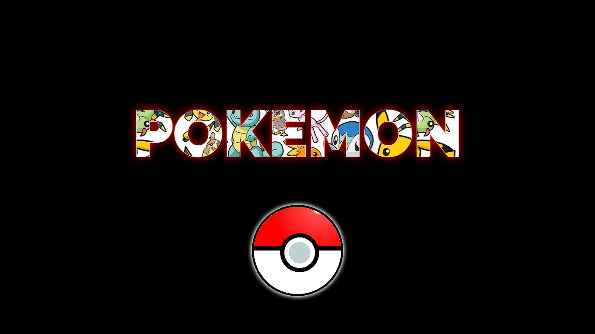
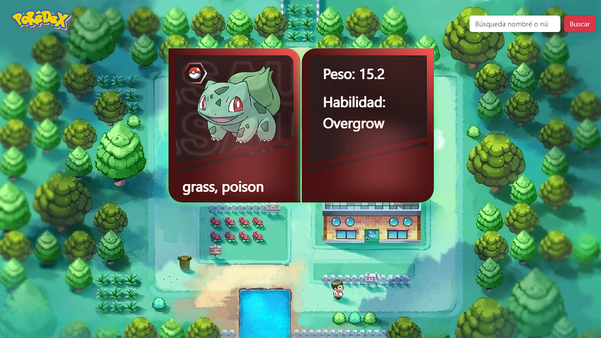

<h1 align="center">Hola 👋, soy Cristian Arias</h1>

###

Soy un apasionado en el desarrollo web, en este momento me encuentro realizando un proyecto de Pokédex. En el cual almacena información sobre las diferentes especies de Pokémon. Proporciona detalles como su tipo, habilidades, características.

###

<h2 align="left">Pokédex.</h2>

###

<!-- 🔭 Actualmente estoy trabajando para la mejora, se actualizo para ver las card del proyecto [Pokedex.](https://cristian0813.github.io/Pokedex/) -->

###

  
  
  

###

<h2 align="left">Codifico con</h2>

###

  
  
  
  
  
  

###

<h2 align="left">Redes sociales.</h2>

###

  
  
  

###
